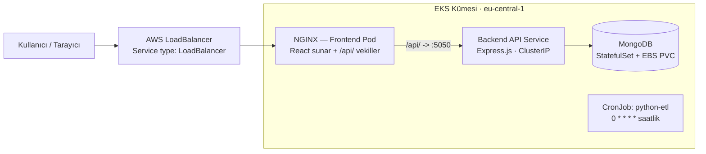

# DevOps Vaka Çalışması — AWS EKS Üzerinde MERN Stack & Python ETL

🌐 **Dil / Language:** **Türkçe** · [English](README.md)

İki farklı iş yükünü tam otomatik bir CI/CD hattı üzerinden **AWS EKS (Kubernetes)**'e dağıtan uçtan uca bir DevOps çözümü: konteynerleştirilmiş bir **MERN** uygulaması (MongoDB, Express.js, React, Node.js) ve zamanlanmış bir **Python ETL** işi. Tüm bulut altyapısı **Terraform** ile sağlanır — AWS konsolunda elle hiçbir şey oluşturulmaz.

Bu belge bir mühendislik kaydı olarak yazılmıştır. Her büyük karar; ele aldığı problem, seçilen seçenek ve — açıkça — neyin kazanıldığı ve neyin feda edildiği ile birlikte sunulur. Çalışan YAML asgari beklentidir; buradaki amaç onun arkasındaki mühendislik muhakemesini göstermektir.

---

## Bölüm 1 — Yönetici Özeti

Depo, tek bir EKS kümesine iki iş yükü teslim eder. **MERN uygulaması** üç imaja bölünmüştür: statik varlıklara derlenip NGINX ile sunulan bir React frontend, bir Express.js REST API ve MongoDB. Frontend'in NGINX katmanı aynı zamanda bir **ters vekil (reverse proxy)** görevi görür ve her `/api/` isteğini küme içindeki backend Service'ine yönlendirir. Bu tek karar, `localhost:5050` gömülü (hardcode) adres sorununu ortadan kaldırır, CORS'u tamamen yok eder ve frontend imajını yerel, staging ve üretimde aynı yapar — ortam başına yeniden derleme gerekmez. **Python ETL** iş yükü, `0 * * * *` (saatlik) zamanlamasıyla bir Kubernetes **CronJob** olarak çalışır; bu, başlaması, işini yapması ve sonlanması gereken bir görev için doğru ilkeldir (primitive).

Tüm altyapı **Infrastructure as Code**'dur. Terraform (`infra/terraform/`); VPC'yi, EKS control plane'i ve SPOT tabanlı yönetilen bir node group'u, üç ECR deposunu, **EBS CSI driver** eklentisini ve GitHub Actions'ın AWS'ye uzun ömürlü erişim anahtarı olmadan kimlik doğrulamasını sağlayan en az ayrıcalıklı (least-privilege) bir **OIDC** IAM rolünü sağlar. Tüm ortam bildirimsel (declarative) olduğundan, pull request'lerde gözden geçirilebilir ve temiz bir hesapta `terraform apply` ile yeniden üretilebilir.

**CI/CD hattı** (GitHub Actions) **Build → Test → Push (ECR) → Deploy (EKS)** akışını çalıştırır. MERN hattı iki aşamalı bir kalite kapısıdır: deploy işi, tüm yığını Docker Compose ile ayağa kaldırıp **Cypress E2E** testlerini `wait-on` yardımcı aracıyla servis hazırlığına bağlı olarak çalıştıran bir integration-test işine (`needs:`) bağımlıdır. Testler başarısız olursa deploy işi hiç başlamaz — kırmızı bir build'den üretime giden bir yol yoktur. İmajlar değişmez (immutable) `github.sha` etiketiyle sürümlenir ve sıfır kesintili (zero-downtime) güncellemeler için `kubectl set image` ile devreye alınır.

Aşağıdaki bölümler her aşamayı ayrıntılandırır. Mevcut durumun üretim-doğru hedefin bilinçli olarak gerisinde kaldığı yerlerde — örneğin henüz bağlanmamış konteyner probe'ları ve Kubernetes Secret'ları — bu durum üzeri örtülmek yerine, giderme yolu belgelenmiş bir **Altyapı Borcu (Infrastructure Debt)** olarak etiketlenir.

### Depo haritası

```
.
├── .github/workflows/          # CI/CD hatları
│   ├── mern-ci-cd.yml          #   Build → Test (Cypress) → Push ECR → Deploy EKS
│   └── python-ci-cd.yml        #   Build → Push ECR → CronJob güncelle
├── docker-compose.yml          # Yerel, tek komutluk tam yığın ortamı
├── infra/terraform/            # IaC: VPC, EKS, ECR, EBS CSI, OIDC/IAM
│   ├── vpc.tf  eks.tf  ecr.tf  oicd.tf  outputs.tf  providers.tf
├── kubernetes/
│   ├── mern/                   # backend, frontend, mongo manifestoları
│   └── python/                 # ETL CronJob
├── mern-project/
│   ├── client/                 # React + NGINX (Dockerfile, nginx.conf)
│   └── server/                 # Express API (Dockerfile, routes)
└── python-project/             # ETL.py + Dockerfile
```

### Bileşen referansı

| Bileşen    | İmaj tabanı                   | Konteyner portu | K8s kaynağı                   | Servis tipi    |
| :--------- | :---------------------------- | :-------------- | :---------------------------- | :------------- |
| Frontend   | `nginx:stable` (statik React) | 80              | `Deployment` (2 replika)      | `LoadBalancer` |
| Backend    | `node:18-bullseye-slim`       | 5050            | `Deployment` (2 replika)      | `ClusterIP`    |
| MongoDB    | `mongo:latest`                | 27017           | `StatefulSet` + PVC (10Gi)    | Headless       |
| Python ETL | `python:3.11-slim`            | —               | `CronJob` (`0 * * * *`)       | —              |

### Mimari



Tek satırda trafik akışı:
`Kullanıcı → AWS LoadBalancer → NGINX (frontend pod: React sunar + /api/ vekiller) → Backend API Service → MongoDB`.

---

## Bölüm 2 — Ayrıntılı Bölümler

### 2.1 Infrastructure as Code (AWS Üzerinde Terraform)

**Amaç.** Tüm bulut ayak izini bildirimsel olarak ayağa kaldırmak; böylece gözden geçirilebilir, tekrarlanabilir ve yok edilebilir olsun — konsolda tıklama işi (click-ops) yok.

**Terraform'un sağladıkları** (`infra/terraform/`):

| Dosya         | Sağladıkları                                                                     |
| :------------ | :------------------------------------------------------------------------------- |
| `vpc.tf`      | 3 AZ'ye yayılmış VPC (`10.0.0.0/16`), ELB keşfi için etiketlenmiş public subnet'ler |
| `eks.tf`      | EKS kümesi `mern-case-cluster` (v1.30), SPOT node group, EBS CSI eklentisi, IRSA |
| `ecr.tf`      | Üç ECR deposu: `mern-frontend`, `mern-backend`, `python-etl`                     |
| `oicd.tf`     | GitHub OIDC sağlayıcı rolü + en az ayrıcalık politikası + EKS access entry       |
| `outputs.tf`  | Küme adı/endpoint'i ve çalıştırmaya hazır `update-kubeconfig` komutu             |
| `providers.tf`| `~> 5.0`'a sabitlenmiş AWS sağlayıcı, `eu-central-1` bölgesi, varsayılan etiketler |

**Kararlar ve ödünleşimler (trade-off'lar).**

- **Yalnızca public subnet, NAT Gateway yok.** *Kazanılan:* Bir NAT Gateway AZ başına ~30$+/ay artı veri işleme ücretine mal olur; onu çıkarmak vaka çalışmasını ucuz tutar ve node'lar yine de doğrudan internete erişir. *Feda edilen:* Worker node'lar public IP taşır ve özel ağ arkasında izole değildir — bir demo için kabul edilebilir, ancak **üretim deseni değildir** (üretimde node'lar NAT arkasındaki private subnet'lere yerleştirilmeli ve yalnızca load balancer dışarı açılmalıdır).
- **Node group için SPOT kapasite** (`t3.small`/`t3.medium`, min 1 / istenen 2 / maks 4). *Kazanılan:* ~%70'e varan daha ucuz işlem gücü. *Feda edilen:* Node'lar 2 dakikalık bir uyarıyla geri alınabilir; iş yükleri replika bazında durumsuz (stateless) ve MongoDB tek replikalı bir demo olduğundan bu tolere edilebilir.
- **Konsol yerine IaC.** *Kazanılan:* Her değişiklik gözden geçirilebilir bir diff'tir; ortam felaket kurtarma için sıfırdan yeniden oluşturulabilir; sapma (drift) görünürdür. *Feda edilen:* Konsolda tıklamaya kıyasla daha yüksek başlangıç yazım maliyeti ve bir öğrenme eğrisi.

**Yeniden üret / doğrula.**

```bash
cd infra/terraform
terraform init
terraform plan
terraform apply          # VPC, EKS, ECR, IAM/OIDC, EBS CSI eklentisini oluşturur
terraform output         # küme adı, endpoint, kubeconfig komutu, rol ARN
# ...
terraform destroy        # her şeyi yıkar
```

---

### 2.2 Konteynerleştirme (Dockerfile'lar)

**Amaç.** Temiz bir build/runtime ayrımıyla küçük, tekrarlanabilir ve güvenlik açısından sertleştirilmiş imajlar.

**Frontend** — `mern-project/client/Dockerfile` (multi-stage):

```dockerfile
FROM node:18-bullseye-slim AS builder   # ağır build araçları yalnızca burada yaşar
WORKDIR /app
COPY package*.json ./
RUN npm install
COPY . .
RUN npm run build

FROM nginx:stable AS runner             # çalışma imajı yalnızca statik varlıkları taşır
RUN rm /etc/nginx/conf.d/default.conf
COPY nginx.conf /etc/nginx/conf.d/
COPY --from=builder /app/build /usr/share/nginx/html
EXPOSE 80
```

Multi-stage ayrım, nihai imajın Node.js araç zincirini, `node_modules`'ı ve kaynak kodunu içermemesi anlamına gelir — yalnızca derlenmiş paket ve NGINX. *Kazanılan:* çok daha küçük bir imaj ve daha küçük bir saldırı yüzeyi. *Feda edilen:* biraz daha uzun bir build tanımı ve iki aşamayı senkron tutma ihtiyacı.

**Backend** — `mern-project/server/Dockerfile`: Bağımlılıklar builder aşamasında `npm install --production` ile kurulur, runner'a yalnızca `node_modules` kopyalanır, `NODE_ENV=production` ayarlanır ve konteyner root olmayan **`USER node`**'a düşer.

**Python ETL** — `python-project/Dockerfile`: `python:3.11-slim` tabanlıdır; özel bir sistem kullanıcısı (`etluser:etlgroup`) oluşturur, `/app`'i ona `chown` yapar ve `USER etluser` ile geçiş yapar; böylece konteyner asla root olarak çalışmaz.

| İmaj       | Taban                   | Multi-stage | Root olmayan kullanıcı |
| :--------- | :---------------------- | :---------- | :--------------------- |
| Frontend   | `nginx:stable`          | ✅          | ⚠️ NGINX master root olarak çalışır (borca bakınız) |
| Backend    | `node:18-bullseye-slim` | ✅          | ✅ `node`              |
| Python ETL | `python:3.11-slim`      | —           | ✅ `etluser`           |

**Güvenlik notları ve dürüst boşluklar.**

- Taban imajlar, şişkin varsayılanlar yerine sabitlenmiş `slim`/`stable` etiketleri kullanır; `.dockerignore`/`.gitignore` sırları ve `node_modules`'ı build bağlamının dışında tutar.
- **Borç:** Frontend NGINX master süreci root olarak çalışır. Sertleştirme yolu `nginxinc/nginx-unprivileged` artı yüksek bir `listen` portudur. Demoyu basit tutmak için olduğu gibi bırakılmıştır.

---

### 2.3 `localhost` → Ters Vekil Dönüşümü *(kıdemli anlatı #1)*

**Problem.** React frontend, API'yi başlangıçta `http://localhost:5050`'de çağırıyordu. Bir tarayıcıda `localhost`, backend sunucusunu değil *istemcinin kendi makinesini* çözer — bu yüzden uygulama konteynerleştirilip gerçek bir kullanıcıya sunulduğu an, her API çağrısı kırılır. Naif düzeltmelerin ikisi de kötüdür: ortama özgü bir API URL'sini build sırasında gömmek ortam başına yeniden derleme zorunlu kılar, backend'i çapraz-kaynak (cross-origin) çağırmak ise CORS yapılandırmasını sürükler getirir.

**Kıdemli çözüm.** **NGINX'i frontend pod'unun içinde bir ters vekil olarak** çalıştırın. React kodu **göreli (relative)** yollar çağırır — `fetch("/api/record")`, `fetch("/api/healthcheck/")` — ve NGINX, `/api/` altındaki her şeyi backend Kubernetes Service'ine iletir. İstekler aynı-kaynak (same-origin) olduğu için CORS yoktur; URL göreli olduğu için aynı imaj her ortamda değişmeden çalışır.

`mern-project/client/nginx.conf` içinden:

```nginx
location /api/ {
    proxy_pass http://backend:5050/;              # sondaki "/" işareti /api ön ekini soyar
    proxy_http_version 1.1;
    proxy_set_header Host              $host;
    proxy_set_header X-Real-IP         $remote_addr;
    proxy_set_header X-Forwarded-For   $proxy_add_x_forwarded_for;
    proxy_set_header X-Forwarded-Proto $scheme;
}
```

Direktif direktif:

- `proxy_pass http://backend:5050/` — `backend`, Kubernetes DNS tarafından backend `ClusterIP` Service'ine çözülür. **Sondaki eğik çizgi** kritiktir: `/api/record`'ı `/record`'a yeniden yazar ve Express route'larıyla (`app.use("/record", ...)`) eşleşir.
- `proxy_http_version 1.1` — upstream'e keep-alive'ı etkinleştirir.
- `X-Real-IP` / `X-Forwarded-For` / `X-Forwarded-Proto` — orijinal istemci IP'sini ve şemasını korur; böylece backend vekili değil gerçek çağıranı görür.

**Ödünleşim.** *Kazanılan:* sıfır CORS, ortam başına sıfır yeniden derleme ve backend adreslemesinden tamamen ayrılmış bir frontend (uygulamayı değil, backend Service'ini değiştirin). *Feda edilen:* NGINX, sağlıklı kalması gereken yol-içi (in-path) bir bileşen hâline gelir ve akıl yürütülecek bir yapılandırma yüzeyi daha ekler. Taşınabilir, konteynerleştirilmiş bir uygulama için bu doğru takastır.

**Doğrula.** `curl -i http://<frontend>/api/healthcheck/` backend'in healthcheck yanıtını döndürmeli; bu, vekil sıçramasının uçtan uca çalıştığını kanıtlar.

---

### 2.4 EKS Üzerinde Kubernetes Orkestrasyonu

**Amaç.** İş yüklerini yüksek erişilebilirlik, servis keşfi ve iş yükü tipine göre doğru ilkel (primitive) ile çalıştırmak.

**Deployment'lar & Service'ler** (`kubernetes/mern/`):

- **Frontend** — `Deployment`, `replicas: 2`, önünde `type: LoadBalancer` bir `Service`; bu, AWS'nin otomatik olarak bir ELB sağlamasını tetikler ve internete açılan tek bileşendir.
- **Backend** — `Deployment`, `replicas: 2`, varsayılan `ClusterIP` tipinde bir `Service` — yalnızca küme içinden erişilebilir; tam da ters-vekillenmiş bir API'nin olması gerektiği gibi.
- **Servis keşfi** — bileşenler birbirlerine IP ile değil DNS adıyla (`backend:5050`, `mongodb:27017`) erişir; böylece pod'lar serbestçe yeniden zamanlanabilir.

**Ölçekleme.** İki replika, temel yüksek erişilebilirlik (HA) sağlar ve load balancer'ın trafiği dağıtmasına imkân verir. Her iki Deployment da durumsuz olduğundan **HPA'ya hazırdır**: CPU/bellek üzerinde bir `HorizontalPodAutoscaler` eklemek kod değişikliği gerektirmez. Bu adım bilinçli olarak ertelenmiştir (aşağıdaki borca bakınız), çünkü HPA kullanımı hesaplamak için kaynak *request*'lerine ihtiyaç duyar.

**CronJob olarak Python ETL** (`kubernetes/python/cronjob.yaml`):

```yaml
spec:
  schedule: "0 * * * *"          # her saatin başında
  successfulJobsHistoryLimit: 3
  failedJobsHistoryLimit: 1
  jobTemplate:
    spec:
      template:
        spec:
          restartPolicy: OnFailure
```

**Neden `CronJob`, uyku döngülü bir Deployment değil.** Bir Deployment, bir süreci sonsuza dek çalışır tutmak için tasarlanmıştır; işi onun içinde zamanlamak, kendi `while true: sleep 3600` döngünüzü yazmak demektir. Bu yaklaşım Kubernetes'in zaten yaptığını yeniden uygular, birkaç saniyelik bir işi çalıştırmak için bir pod'u (ve belleğini) 7/24 yerleşik tutar, kaçırılan çalıştırma ya da geçmiş kavramına sahip değildir ve uyku ortasındaki bir çökmeyi sessiz bir boşluğa çevirir. `CronJob` amaca özel yapılmış ilkeldir: zamanlamayı planlayıcı yönetir, her çalıştırma başlayıp sonlanan izole bir `Job`'dur, `restartPolicy: OnFailure` başarısız bir denemeyi yeniden dener ve `*JobsHistoryLimit`, hata ayıklama için tutulan geçmişi sınırlar. *Kazanılan:* doğru semantik ve neredeyse sıfır boşta maliyet. *Feda edilen:* bu iş yükü için anlamlı hiçbir şey.

**Altyapı Borcu (Kubernetes sertleştirme listesi).** Mevcut manifestolar, bir üretim kümesinin sahip olması gereken üç şeyi atlar; bunlar iddia edilmek yerine dürüstçe belirtilmiştir:

| Eksik                     | Neden önemli                                             | Giderme                                                  |
| :------------------------ | :------------------------------------------------------ | :------------------------------------------------------- |
| Liveness/readiness probe'ları | K8s takılmış bir pod'u sağlıklı olandan ayıramaz; rollout'un hazırlık kapısı yoktur | `/healthcheck` (backend) ve `/health` (NGINX ile zaten sunulan frontend) üzerine `readinessProbe`/`livenessProbe` ekleyin |
| Kaynak request/limit'leri | Zamanlama garantisi yok; HPA kullanımı hesaplayamaz; gürültülü bir pod komşularını aç bırakabilir | Her konteynere `resources.requests`/`limits` tanımlayın |
| K8s Secret'ları           | `ATLAS_URI` satır içi düz metin bir `env` değeridir     | Bağlantı dizelerini bir `Secret` + `envFrom`'a taşıyın  |

**Doğrula.**

```bash
kubectl get pods,svc
kubectl get svc frontend            # EXTERNAL-IP = load balancer DNS'i
kubectl get cronjob python-etl-job
kubectl get jobs                    # CronJob'un oluşturduğu çalıştırma geçmişi
```

**CronJob'u talep üzerine test etme.** Saatin başını beklemeye gerek yok — CronJob'un pod şablonunu hemen çalışan bir Job'a klonlayın:

```bash
kubectl create job etl-test --from=cronjob/python-etl-job   # şimdi çalışır, zamanlamayı yok sayar
kubectl get pods -l job-name=etl-test                       # STATUS -> Completed
kubectl logs  -l job-name=etl-test                          # ETL çıktısı
kubectl delete job etl-test                                 # temizle (job adı benzersiz olmalı)
```

**Geçici hatalar üzerine not.** `ETL.py`, zaman aşımı, yeniden deneme veya hata işleme olmadan tek bir korumasız dışa çağrı (`requests.get('https://api.github.com')`) yapar; bu yüzden herhangi bir ağ/DNS kesintisi ya da upstream 5xx o çalıştırmayı başarısız kılar. Bir Job backoff limitini aştığında Pod'u silinir ve yalnızca Job nesnesi kalır; bu nedenle `kubectl logs job/...` sonradan hiçbir şey döndürmez — logları, pod hâlâ mevcutken talep üzerine bir çalıştırmadan (yukarıda) yakalayın. Sertleştirme yolu: çağrıyı `Retry` + `timeout` içeren bir `requests.Session` ile sarın ve hata kanıtını hata ayıklama için tutmak üzere `failedJobsHistoryLimit`'i artırın.

---

### 2.5 Depolama Stratejisi & Altyapı Borcu Yönetimi *(kıdemli anlatı #2)*

**Problem.** EKS 1.30'da eski, ağaç-içi (in-tree) AWS EBS provisioner artık çalışmaz. Çalışan bir CSI driver ve bir StorageClass olmadan, MongoDB'nin `PersistentVolumeClaim`'i sonsuza dek `Pending` kalır, pod asla zamanlanamaz ve tüm StatefulSet kilitlenir. Bu, klasik "veritabanı pod'um `Pending` ve nedenini bilmiyorum" tuzağıdır.

**Uygulanan çözüm — bir kestirme değil, üretim-doğru yol.** MongoDB'yi geçici `emptyDir`'e taşıyarak problemi es geçmek (ki bu, her pod yeniden başlatmasında tüm veriyi sessizce çöpe atardı) yerine, **AWS EBS CSI driver** doğrudan Terraform'da bir EKS eklentisi olarak kurulur ve driver'ın statik kimlik bilgileri olmadan volume sağlayabilmesi için özel bir IRSA rolüne bağlanır. `infra/terraform/eks.tf` içinden:

```hcl
cluster_addons = {
  aws-ebs-csi-driver = {
    most_recent              = true
    service_account_role_arn = module.ebs_csi_irsa.iam_role_arn
  }
}
```

MongoDB daha sonra, gerçek bir EBS volume ile desteklenen ve kararlı ağ kimliği için başsız (headless) bir Service ile önlenen **`volumeClaimTemplates`'lı bir `StatefulSet`** (`kubernetes/mern/mongo.yaml`) olarak çalışır:

```yaml
volumeClaimTemplates:
  - metadata: { name: mongo-data }
    spec:
      accessModes: ["ReadWriteOnce"]
      storageClassName: gp2
      resources:
        requests: { storage: 10Gi }
```

*Kazanılan:* veri, pod yeniden başlatmalarına ve yeniden zamanlamalarına dayanır — bir veritabanı için doğru davranış. *Feda edilen:* `ReadWriteOnce` bir EBS volume tek AZ'ye sabitlenir; bu yüzden MongoDB pod'u tek bir Availability Zone'a bağlanır ve sağlama, ilk zamanlamaya birkaç saniye ekler.

**Kalan Altyapı Borcu.** Depolama katmanı çalışır, ancak henüz üretim düzeyinde değildir:

| Endişe            | Mevcut durum                            | Üretim hedefi                                                  |
| :---------------- | :-------------------------------------- | :------------------------------------------------------------ |
| StorageClass      | `gp2` (daha eski, daha yavaş, daha pahalı) | Açık bir `gp3` StorageClass tanımlayın (daha ucuz, daha yüksek temel IOPS) |
| Erişilebilirlik   | Tek MongoDB replikası, tek EBS/AZ       | AZ'ler arası 3 üyeli replica set veya yönetilen bir servis    |
| Operasyonel yük   | Küme içinde kendi yönetilen MongoDB     | **MongoDB Atlas** veya **Amazon DocumentDB** — yedek, yama, failover'ı devret |
| Yedekler          | Yapılandırılmamış                       | Otomatik anlık görüntüler / zaman-içinde kurtarma (PITR)      |

Gerçek bir dağıtım için açık öneri, veritabanını küme içinde çalıştırmayı tamamen bırakıp yönetilen bir servis kullanmaktır; küme içi StatefulSet, kendi kendine yeterli bir vaka çalışması için doğru seçimdir ve bir gözden kaçma değil, bilinçli, belgelenmiş bir ödünleşimdir.

---

### 2.6 CI/CD Hattı (GitHub Actions) *(kıdemli anlatı #3)*

**Amaç.** Testleri geçmeden hiçbir şeyin üretime ulaşmadığı ve hiçbir yerde uzun ömürlü bulut kimlik bilgisinin bulunmadığı bir hat.

**Aşamalar** (`.github/workflows/mern-ci-cd.yml`), kapı yapısal olsun diye iki işe bölünmüştür:

| Aşama       | İş / adım                           | Ne olur                                                   |
| :---------- | :---------------------------------- | :------------------------------------------------------- |
| **Build**   | `integration-test` → Docker Compose | Tüm yığın (mongo + backend + frontend) derlenir ve başlatılır |
| **Test**    | `integration-test` → Cypress        | E2E testleri **yalnızca** hazırlık kapısı geçildikten sonra çalışır |
| **Push**    | `build-and-deploy` → ECR            | Backend & frontend derlenir, `github.sha` ile etiketlenir, push edilir |
| **Deploy**  | `build-and-deploy` → EKS            | Her iki Deployment'ta `kubectl set image` ile rolling update |

Deploy işi `needs: integration-test` bildirir; böylece **başarısız bir test paketi deploy'u tamamen engeller** — kırmızı bir build'den kümeye giden bir yol yoktur.

**Problem — sağlık kontrollerinde yarış koşulları (race condition).** Backend'e karşı düz bir `curl` döngüsü konteynerin başlangıcıyla yarışır: bağlantı henüz gerçekten hizmet vermeyen bir sokette başarılı olabilir ya da kontrol `|| true` ile yazılmış olup hataları yutabilir; böylece Cypress hazır olmayan bir yığına karşı başlar ve çalıştırma tutarsızlaşır (flake) veya yanlış-geçer.

**Kıdemli çözüm — `wait-on` ile belirlenimci hazırlık kapısı.** Cypress action'ı, tek bir test bile çalışmadan önce uygulama gerçekten erişilebilir olana kadar `wait-on` üzerinde bekler:

```yaml
- name: Backend Healthcheck            # yalnızca en iyi çaba ile ısınma
  run: curl --retry 20 --retry-delay 5 http://localhost:5050/healthcheck/ || true
- name: Cypress E2E Tests
  uses: cypress-io/github-action@v6
  with:
    working-directory: ./mern-project/client
    wait-on: 'http://localhost:3000'   # belirlenimci kapı: testler yalnızca uygulama yanıt verince başlar
    browser: chrome
```

`wait-on`, URL'yi yoklar ve yalnızca yanıt geldiğinde döner; "yeterince bekle ve umut et"i "tam hazır olunca ilerle"ye çevirir. *Kazanılan:* tahmini bir `sleep` yerine gerçek başlangıç süresiyle ölçeklenen, belirlenimci ve tutarsızlaşmayan E2E kapısı. *Feda edilen:* küçük bir bağımlılık ve `wait-on`'u doğru hazırlık URL'sine yöneltme disiplini. *(Borç: `curl` ısınması hâlâ `|| true` taşır, dolayısıyla işi tek başına başarısız kılamaz — gerçek kapı `wait-on`'dur; düzeltme, doğrudan backend sağlık URL'sinde kapı kurmak ve `|| true`'yu kaldırmaktır.)*

**Sır yönetimi.** AWS kimlik doğrulaması, kısa ömürlü bir token için `secrets.AWS_ROLE_ARN`'ı üstlenmek üzere **GitHub OIDC** (`permissions: id-token: write`) kullanır — depoda ya da GitHub secret'larında **hiçbir** AWS erişim anahtarı saklanmaz. Üstlenilen rol en az ayrıcalıklıdır (bkz. §2.8). İmajlar değişmez `github.sha` ile sürümlenir; böylece her dağıtım tam bir commit'e izlenebilir ve geri almalar (rollback) belirsizlik taşımaz.

**Python hattı** (`.github/workflows/python-ci-cd.yml`): ETL imajını derler, ECR'a push eder ve CronJob'u `kubectl set image cronjob/python-etl-job ...` ile günceller. Her iki hat da `paths:` filtreleri kullanır; böylece her biri yalnızca kendi projesi değiştiğinde tetiklenir.

---

### 2.7 Günlük Kaydı & Uyarı (Logging & Alerting)

**Log toplama — mevcut durum.** Her konteyner, konteyner içindeki dosyalara değil `stdout`/`stderr`'e yazar (12-Factor tarzı); bu, küme düzeyinde herhangi bir toplama için ön koşuldur. Bugün loglar talep üzerine okunur:

```bash
kubectl logs deploy/backend
kubectl logs -l app=frontend
kubectl logs job/<python-etl-job-run>
```

Sağlık sinyalleri iki katmanda mevcuttur: backend `GET /healthcheck` (uptime + zaman damgası) sunar ve NGINX, kontrolü sessiz tutmak için `access_log off` ile `{"status":"UP","service":"frontend"}` döndüren `GET /health` sunar. NGINX hata günlüğü `warn` seviyesindedir.

**Merkezileştirme & uyarı — belgelenmiş hedef (Altyapı Borcu).** Loglar zaten stdout'a aktığından, merkezi toplamayı açmak kod değil yapılandırma işidir:

- Pod loglarını ve metriklerini küme genelinde toplamak için **CloudWatch Container Insights** (veya bir **Fluent Bit DaemonSet** → OpenSearch/Loki).
- Kritik olaylarda **uyarı** — pod `CrashLoopBackOff`, başarısız CronJob çalıştırmaları (`kube_job_status_failed`), backend 5xx oranı, node baskısı — **CloudWatch Alarms → SNS** üzerinden e-posta/Slack'e.

Bu, depoda dürüstçe *henüz bağlanmamıştır*; uygulama enstrümante edilmiştir (stdout + sağlık uçları), böylece etkinleştirmek bir tak-çalıştır işidir, ancak bugün hiçbir toplama arka ucu veya uyarı kanalı sağlanmamıştır.

---

### 2.8 Güvenlik Değerlendirmeleri

- **Statik bulut kimlik bilgisi yok.** GitHub Actions, AWS'ye OIDC federasyonu ile kimlik doğrular ve kısa ömürlü bir token için bir rol üstlenir; depoda, kodda veya GitHub secret'larında erişim anahtarı yoktur.
- **En az ayrıcalıklı IAM** (`infra/terraform/oicd.tf`). GitHub Actions rolü tam olarak ihtiyacı olana kapsanmıştır: küresel `ecr:GetAuthorizationToken`, yalnızca **üç adlandırılmış ECR deposuna** push/pull ve yalnızca **bu** küme üzerinde `eks:DescribeCluster`. Küme API erişimi, kapsamlı bir EKS Access Entry ile verilir.
- **Ağ açıklığı yalnızca load balancer ile sınırlı.** Yalnızca frontend Service'i `LoadBalancer`'dır; backend ve MongoDB küme içidir (`ClusterIP`/headless) ve asla dışarıdan erişilebilir değildir.
- **İmaj hijyeni.** Multi-stage build'ler, build araçlarını ve kaynağı çalışma imajlarından uzak tutar; backend ve Python konteynerleri root olmayan kullanıcılarla çalışır; taban imajlar sabitlenmiştir.
- **HTTP güvenlik başlıkları** (`nginx.conf`): `server_tokens off`, `X-Frame-Options`, `X-XSS-Protection`, `X-Content-Type-Options: nosniff`, `Referrer-Policy`.
- **Bilinen boşluklar (borç).** `ATLAS_URI` satır içi düz metin bir env değeridir ve bir Kubernetes `Secret`'a taşınmalıdır; node'lar public subnet'lerde durur (bkz. §2.1); frontend NGINX master root olarak çalışır (bkz. §2.2).

---

### 2.9 Başarı Kanıtları

AWS EKS üzerindeki canlı dağıtımdan alınan ekran görüntüleri.

#### Canlı frontend & backend

LoadBalancer üzerinden sunulan React SPA; backend'e NGINX `/api/` ters vekili üzerinden erişilir — uçtan uca çalışan CRUD.


#### MongoDB bağlantısı & kalıcılık

Arayüzde oluşturulan kayıtlar MongoDB'de saklanır ve pod yeniden başlatmalarına dayanır (StatefulSet + EBS PVC).


#### CI/CD — yeşil hat çalıştırmaları

Her iki GitHub Actions hattı geçiyor: MERN hattı (Build → Cypress E2E → Push ECR → Deploy EKS) ve Python ETL hattı (Build → Push ECR → CronJob güncelle).


#### Küme durumu — pod'lar, servis & ETL CronJob

Tüm pod'ların `Running` olduğunu, frontend Service'inin dolu bir `EXTERNAL-IP` (load balancer DNS) taşıdığını ve ETL CronJob'un başarılı çalıştırma geçmişini gösteren `kubectl` çıktısı.


---

### 2.10 Depo Yapısı & Nasıl Çalıştırılır

```
.
├── .github/workflows/
│   ├── mern-ci-cd.yml
│   └── python-ci-cd.yml
├── docker-compose.yml
├── infra/terraform/
│   ├── vpc.tf  eks.tf  ecr.tf  oicd.tf  outputs.tf  providers.tf
├── kubernetes/
│   ├── mern/     (backend.yaml  frontend.yaml  mongo.yaml)
│   └── python/   (cronjob.yaml)
├── mern-project/
│   ├── client/   (Dockerfile  nginx.conf  src/ …)
│   └── server/   (Dockerfile  server.mjs  routes/ …)
└── python-project/  (ETL.py  Dockerfile)
```

**Ön gereksinimler.** `docker`, `docker compose`, `kubectl`, `aws-cli`, `terraform`.

**Uçtan uca yeniden üretim, klondan canlı URL'ye:**

1. **Önce yerel çalıştırın (isteğe bağlı sağlık kontrolü).**
   ```bash
   docker compose up -d --build
   # Frontend http://localhost:3000 · Backend http://localhost:5050 · Mongo :27017
   docker compose down -v
   ```
2. **Altyapıyı sağlayın.**
   ```bash
   cd infra/terraform && terraform init && terraform apply
   ```
3. **CI/CD'yi bağlayın.** `terraform output github_actions_role_arn` değerini alın ve `AWS_ROLE_ARN` GitHub secret'ı olarak ayarlayın.
4. **kubectl'i kümeye bağlayın.**
   ```bash
   aws eks update-kubeconfig --region eu-central-1 --name mern-case-cluster
   ```
5. **Dağıtın** — `main`'e push edin ve hattın build → test → push → deploy yapmasına izin verin, **ya da** elle uygulayın:
   ```bash
   kubectl apply -f kubernetes/mern/
   kubectl apply -f kubernetes/python/
   ```
   > Manifestolar `<AWS_ACCOUNT_ID>`/`<REGION>` yer tutucuları taşır; hat, dağıtım sırasında `kubectl set image` ile gerçek ECR imaj adreslerini yerine koyar.
6. **Canlı URL'yi alın.**
   ```bash
   kubectl get svc frontend    # EXTERNAL-IP'yi bir tarayıcıda açın
   ```
7. **İşiniz bittiğinde yıkın:** `terraform destroy`.

---

## Zorluklar & Mühendislik Kararları — bir bakışta

| # | Zorluk | Çözüm | Ödünleşim |
| :- | :--- | :--- | :--- |
| 1 | Frontend `localhost:5050`'e gömülü, konteynerleşince kırılıyor | Göreli `/api/` yollarında NGINX ters vekili | +taşınabilir/CORS yok · −NGINX artık istek yolunda |
| 2 | EKS 1.30'da EBS PVC `Pending` takılı (CSI driver yok) | Terraform ile EBS CSI eklentisi + StatefulSet | +kalıcı veri · −volume tek AZ'ye sabit |
| 3 | Yarış koşullu sağlık kontrolleri E2E'yi tutarsızlaştırdı/yanlış-geçirdi | Cypress öncesi belirlenimci `wait-on` kapısı | +güvenilir kapı · −doğru hazırlık URL'sini hedeflemeli |
| 4 | CI'da uzun ömürlü AWS anahtarları sürekli bir risk | GitHub OIDC → kısa ömürlü üstlenilen rol | +anahtarsız/en az ayrıcalık · −daha fazla IAM/OIDC kurulumu |
| 5 | Test edilmemiş kod üretime ulaşabilir | İki işli hat, deploy `needs:` testler | +sert kalite kapısı · −biraz daha uzun hat |
| 6 | Tek aşamalı build'ler üretime build araçları taşır | Multi-stage build + `slim` tabanlar + non-root | +daha küçük/güvenli imajlar · −daha ayrıntılı Dockerfile'lar |

---

*Bu README, depoyu gerçekte olduğu hâliyle belgeler. Mevcut durumun üretim-doğru hedef yerine bilinçli, teslimat-öncelikli bir ödünleşim olduğu yerlerde — probe'lar, kaynak limitleri, Kubernetes Secret'ları, bir `gp3` StorageClass, yönetilen bir veritabanı ve bağlanmış log toplama/uyarı gibi geçici konular — bu, giderme yolu belirtilerek Altyapı Borcu olarak etiketlenir; böylece bir değerlendirici, bilinçli bir kestirmeyi bir boşluktan ayırt edebilir.*
