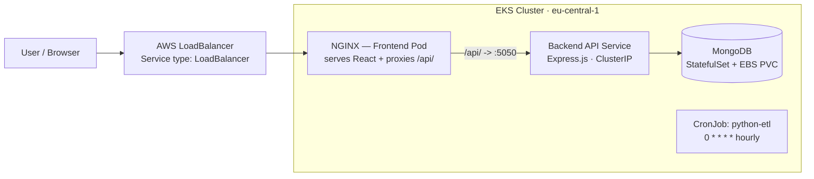
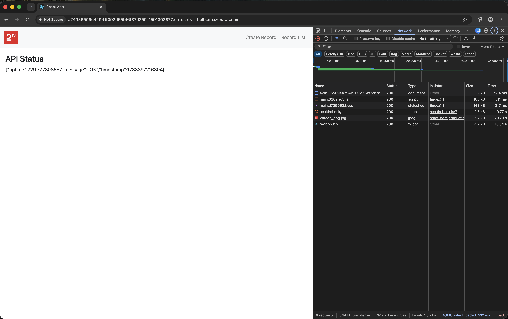
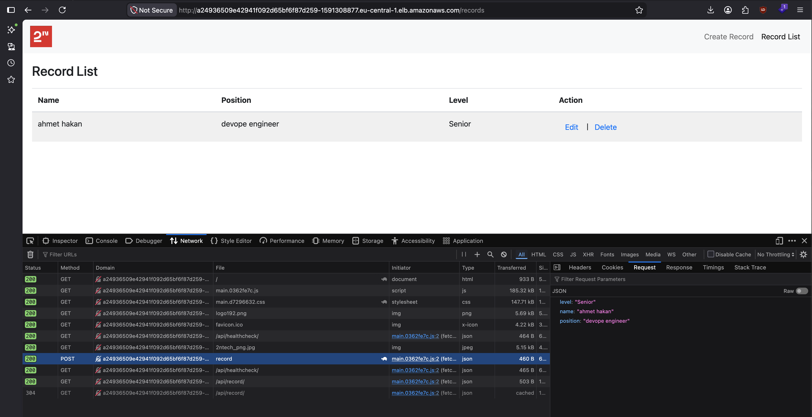
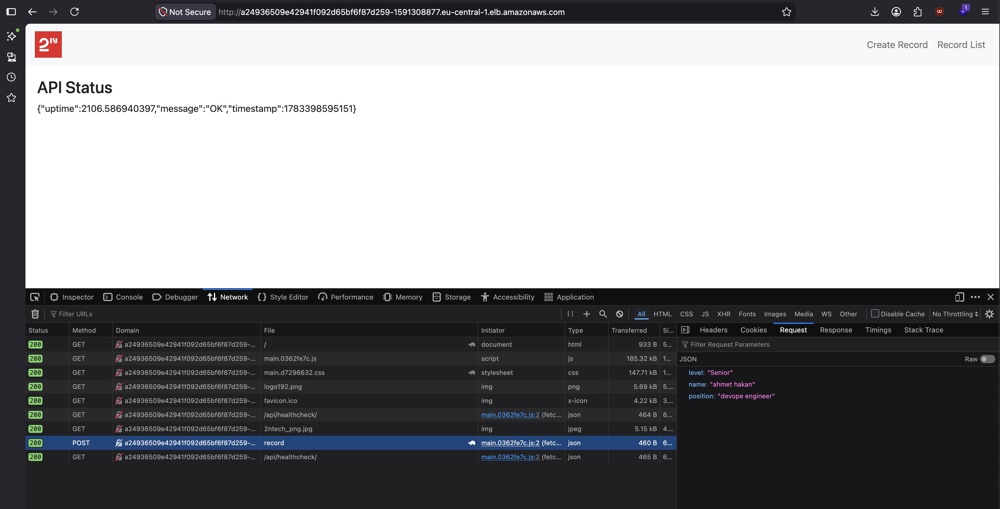
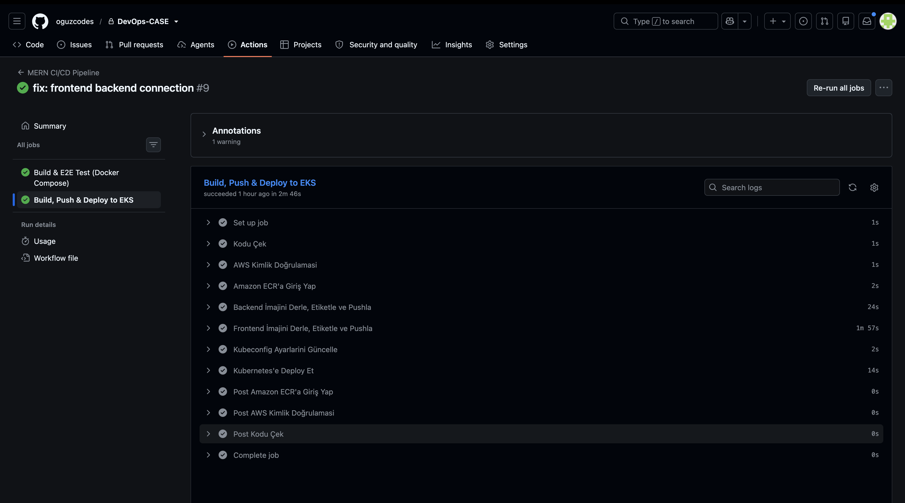
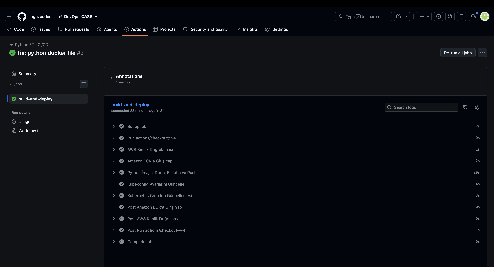
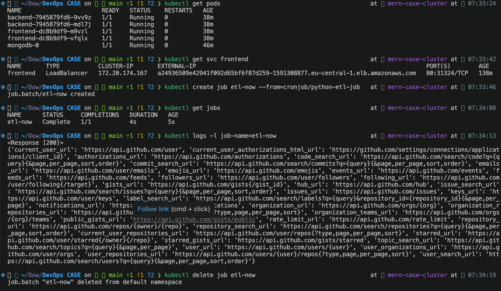

# DevOps Case Study — MERN Stack & Python ETL on AWS EKS

An end-to-end DevOps solution that deploys two distinct workloads to **AWS EKS (Kubernetes)** through a fully automated CI/CD pipeline: a containerized **MERN** application (MongoDB, Express.js, React, Node.js) and a scheduled **Python ETL** job. All cloud infrastructure is provisioned with **Terraform** — nothing is created by hand in the AWS console.

This document is written as an engineering record. Each major decision is presented with the problem it addresses, the option chosen, and — explicitly — what was gained and what was sacrificed. Working YAML is table stakes; the intent here is to show the judgment behind it.

---

## Part 1 — Executive Summary

The repository delivers two workloads onto a single EKS cluster. The **MERN application** is split into three images: a React frontend compiled to static assets and served by NGINX, an Express.js REST API, and MongoDB. The frontend's NGINX layer doubles as a **reverse proxy**, routing every `/api/` request to the backend Service inside the cluster. This single decision removes the `localhost:5050` hardcoding problem, eliminates CORS, and makes the frontend image identical across local, staging, and production — no per-environment rebuilds. The **Python ETL** workload runs as a Kubernetes **CronJob** on the schedule `0 * * * *` (hourly), which is the correct primitive for a task that should start, do its work, and exit.

All infrastructure is **Infrastructure as Code**. Terraform (`infra/terraform/`) provisions the VPC, EKS control plane and a SPOT-backed managed node group, three ECR repositories, the **EBS CSI driver** add-on, and a least-privilege **OIDC** IAM role that lets GitHub Actions authenticate to AWS without any long-lived access keys. Because the whole environment is declarative, it is reviewable in pull requests and reproducible from a clean account with `terraform apply`.

The **CI/CD pipeline** (GitHub Actions) runs **Build → Test → Push (ECR) → Deploy (EKS)**. The MERN pipeline is a two-stage quality gate: the deploy job depends on (`needs:`) an integration-test job that stands the full stack up with Docker Compose and runs **Cypress E2E** tests, gated on service readiness with the `wait-on` utility. If the tests fail, the deploy job never starts — there is no path from a red build to production. Images are versioned with the immutable `github.sha` tag and rolled out with `kubectl set image` for zero-downtime updates.

The sections below expand each stage. Where the current state is deliberately behind the production-correct target — for example, container probes and Kubernetes Secrets that are not yet wired — it is labeled as **Infrastructure Debt** with the remediation path documented, rather than papered over.

### Repository map

```
.
├── .github/workflows/          # CI/CD pipelines
│   ├── mern-ci-cd.yml          #   Build → Test (Cypress) → Push ECR → Deploy EKS
│   └── python-ci-cd.yml        #   Build → Push ECR → Update CronJob
├── docker-compose.yml          # Local, one-command full-stack environment
├── infra/terraform/            # IaC: VPC, EKS, ECR, EBS CSI, OIDC/IAM
│   ├── vpc.tf  eks.tf  ecr.tf  oicd.tf  outputs.tf  providers.tf
├── kubernetes/
│   ├── mern/                   # backend, frontend, mongo manifests
│   └── python/                 # ETL CronJob
├── mern-project/
│   ├── client/                 # React + NGINX (Dockerfile, nginx.conf)
│   └── server/                 # Express API (Dockerfile, routes)
└── python-project/             # ETL.py + Dockerfile
```

### Component reference

| Component  | Image base                    | Container port | K8s resource                  | Service type   |
| :--------- | :---------------------------- | :------------- | :---------------------------- | :------------- |
| Frontend   | `nginx:stable` (static React) | 80             | `Deployment` (2 replicas)     | `LoadBalancer` |
| Backend    | `node:18-bullseye-slim`       | 5050           | `Deployment` (2 replicas)     | `ClusterIP`    |
| MongoDB    | `mongo:latest`                | 27017          | `StatefulSet` + PVC (10Gi)    | Headless       |
| Python ETL | `python:3.11-slim`            | —              | `CronJob` (`0 * * * *`)       | —              |

### Architecture



Traffic path in one line:
`User → AWS LoadBalancer → NGINX (frontend pod: serves React + proxies /api/) → Backend API Service → MongoDB`.

---

## Part 2 — Detailed Sections

### 2.1 Infrastructure as Code (Terraform on AWS)

**Goal.** Stand up the entire cloud footprint declaratively so it is reviewable, repeatable, and destroyable — no click-ops.

**What Terraform provisions** (`infra/terraform/`):

| File          | Provisions                                                                    |
| :------------ | :---------------------------------------------------------------------------- |
| `vpc.tf`      | VPC (`10.0.0.0/16`) across 3 AZs, public subnets tagged for ELB discovery     |
| `eks.tf`      | EKS cluster `mern-case-cluster` (v1.30), SPOT node group, EBS CSI add-on, IRSA |
| `ecr.tf`      | Three ECR repositories: `mern-frontend`, `mern-backend`, `python-etl`         |
| `oicd.tf`     | GitHub OIDC provider role + least-privilege policy + EKS access entry         |
| `outputs.tf`  | Cluster name/endpoint and the ready-to-run `update-kubeconfig` command        |
| `providers.tf`| AWS provider pinned to `~> 5.0`, region `eu-central-1`, default tags           |

**Decisions and trade-offs.**

- **Public subnets only, no NAT Gateway.** *Gained:* a NAT Gateway costs roughly $30+/month per AZ plus data-processing charges; dropping it keeps the case study cheap and nodes still reach the internet directly. *Sacrificed:* worker nodes carry public IPs and are not isolated behind private networking — acceptable for a demo, **not** the production pattern (production should place nodes in private subnets behind NAT and expose only the load balancer).
- **SPOT capacity for the node group** (`t3.small`/`t3.medium`, min 1 / desired 2 / max 4). *Gained:* up to ~70% cheaper compute. *Sacrificed:* nodes can be reclaimed with a 2-minute warning; tolerable because the workloads are stateless-by-replica and MongoDB is a single-replica demo.
- **IaC over the console.** *Gained:* every change is a reviewable diff; the environment can be recreated from scratch for disaster recovery; drift is visible. *Sacrificed:* higher upfront authoring cost and a learning curve versus clicking through the console.

**Reproduce / verify.**

```bash
cd infra/terraform
terraform init
terraform plan
terraform apply          # creates VPC, EKS, ECR, IAM/OIDC, EBS CSI add-on
terraform output         # cluster name, endpoint, kubeconfig command, role ARN
# ...
terraform destroy        # tears everything down
```

---

### 2.2 Containerization (Dockerfiles)

**Goal.** Small, reproducible, security-hardened images with a clean build/runtime split.

**Frontend** — `mern-project/client/Dockerfile` (multi-stage):

```dockerfile
FROM node:18-bullseye-slim AS builder   # heavy build tools live only here
WORKDIR /app
COPY package*.json ./
RUN npm install
COPY . .
RUN npm run build

FROM nginx:stable AS runner             # runtime image ships only static assets
RUN rm /etc/nginx/conf.d/default.conf
COPY nginx.conf /etc/nginx/conf.d/
COPY --from=builder /app/build /usr/share/nginx/html
EXPOSE 80
```

The multi-stage split means the final image contains no Node.js toolchain, no `node_modules`, and no source — only the compiled bundle and NGINX. *Gained:* a dramatically smaller image and a smaller attack surface. *Sacrificed:* slightly longer build definition and the need to keep the two stages in sync.

**Backend** — `mern-project/server/Dockerfile`: dependencies are installed with `npm install --production` in the builder, only `node_modules` are copied into the runner, `NODE_ENV=production` is set, and the container drops to the non-root **`USER node`**.

**Python ETL** — `python-project/Dockerfile`: based on `python:3.11-slim`; creates a dedicated system user (`etluser:etlgroup`), `chown`s `/app` to it, and switches with `USER etluser` so the container never runs as root.

| Image      | Base                    | Multi-stage | Non-root user   |
| :--------- | :---------------------- | :---------- | :-------------- |
| Frontend   | `nginx:stable`          | ✅          | ⚠️ NGINX master runs as root (see debt) |
| Backend    | `node:18-bullseye-slim` | ✅          | ✅ `node`       |
| Python ETL | `python:3.11-slim`      | —           | ✅ `etluser`    |

**Security notes and honest gaps.**

- Base images use pinned `slim`/`stable` tags rather than fat defaults; `.dockerignore`/`.gitignore` keep secrets and `node_modules` out of the build context.
- **Debt:** the frontend NGINX master process runs as root. Hardening path is `nginxinc/nginx-unprivileged` plus a high `listen` port. Left as-is to keep the demo simple.

---

### 2.3 The `localhost` → Reverse Proxy Pivot *(senior narrative #1)*

**The problem.** The React frontend originally called the API at `http://localhost:5050`. In a browser, `localhost` resolves to the *client's own machine*, not the backend server — so the moment the app is containerized and served to a real user, every API call breaks. The naive fixes are both bad: baking an environment-specific API URL in at build time forces a rebuild per environment, and calling the backend cross-origin drags in CORS configuration.

**The senior solution.** Run **NGINX as a reverse proxy inside the frontend pod**. The React code calls **relative** paths — `fetch("/api/record")`, `fetch("/api/healthcheck/")` — and NGINX forwards anything under `/api/` to the backend Kubernetes Service. Because requests are same-origin, there is no CORS; because the URL is relative, the same image runs unchanged in every environment.

From `mern-project/client/nginx.conf`:

```nginx
location /api/ {
    proxy_pass http://backend:5050/;              # trailing "/" strips the /api prefix
    proxy_http_version 1.1;
    proxy_set_header Host              $host;
    proxy_set_header X-Real-IP         $remote_addr;
    proxy_set_header X-Forwarded-For   $proxy_add_x_forwarded_for;
    proxy_set_header X-Forwarded-Proto $scheme;
}
```

Directive by directive:

- `proxy_pass http://backend:5050/` — `backend` is resolved by Kubernetes DNS to the backend `ClusterIP` Service. The **trailing slash** is load-bearing: it rewrites `/api/record` → `/record`, matching the Express routes (`app.use("/record", ...)`).
- `proxy_http_version 1.1` — enables keep-alive to the upstream.
- `X-Real-IP` / `X-Forwarded-For` / `X-Forwarded-Proto` — preserve the original client IP and scheme so the backend sees the real caller, not the proxy.

**Trade-off.** *Gained:* zero CORS, zero per-environment rebuilds, and a frontend fully decoupled from backend addressing (change the backend Service, not the app). *Sacrificed:* NGINX becomes an in-path component that must stay healthy, and it is one more config surface to reason about. For a portable containerized app that is the right trade.

**Verify.** `curl -i http://<frontend>/api/healthcheck/` should return the backend's healthcheck payload, proving the proxy hop works end to end.

---

### 2.4 Kubernetes Orchestration on EKS

**Goal.** Run the workloads with high availability, service discovery, and the right primitive per workload type.

**Deployments & Services** (`kubernetes/mern/`):

- **Frontend** — `Deployment`, `replicas: 2`, fronted by a `Service` of `type: LoadBalancer`, which makes AWS provision an ELB automatically and is the only component exposed to the internet.
- **Backend** — `Deployment`, `replicas: 2`, `Service` of default type `ClusterIP` — reachable only inside the cluster, exactly as a reverse-proxied API should be.
- **Service discovery** — components address each other by DNS name (`backend:5050`, `mongodb:27017`), never by IP, so pods can reschedule freely.

**Scaling.** Two replicas each give baseline HA and let the load balancer spread traffic. Because both Deployments are stateless, they are **HPA-ready**: adding a `HorizontalPodAutoscaler` on CPU/memory requires no code change. That step is intentionally deferred (see debt below) because HPA needs resource *requests* to compute utilization.

**The Python ETL as a CronJob** (`kubernetes/python/cronjob.yaml`):

```yaml
spec:
  schedule: "0 * * * *"          # top of every hour
  successfulJobsHistoryLimit: 3
  failedJobsHistoryLimit: 1
  jobTemplate:
    spec:
      template:
        spec:
          restartPolicy: OnFailure
```

**Why `CronJob`, not a Deployment with a sleep loop.** A Deployment is built to keep a process running forever; scheduling work inside it means writing your own `while true: sleep 3600` loop. That approach reimplements what Kubernetes already does, holds a pod (and its memory) resident 24/7 to run a job for a few seconds, has no concept of missed runs or history, and turns a crash mid-sleep into a silent gap. `CronJob` is the purpose-built primitive: the scheduler owns the timing, each run is an isolated `Job` that starts and exits, `restartPolicy: OnFailure` retries a failed attempt, and `*JobsHistoryLimit` bounds retained history for debugging. *Gained:* correct semantics and near-zero idle cost. *Sacrificed:* nothing meaningful for this workload.

**Infrastructure Debt (Kubernetes hardening backlog).** The current manifests omit three things a production cluster should have; they are called out honestly rather than claimed:

| Missing               | Why it matters                                      | Remediation                                              |
| :-------------------- | :-------------------------------------------------- | :------------------------------------------------------ |
| Liveness/readiness probes | K8s can't tell a hung pod from a healthy one; rollout has no readiness gate | Add `readinessProbe`/`livenessProbe` on `/healthcheck` (backend) and `/health` (frontend, already served by NGINX) |
| Resource requests/limits  | No scheduling guarantees; HPA can't compute utilization; a noisy pod can starve neighbors | Set `resources.requests`/`limits` on each container |
| K8s Secrets           | `ATLAS_URI` is an inline plaintext `env` value      | Move connection strings into a `Secret` + `envFrom`     |

**Verify.**

```bash
kubectl get pods,svc
kubectl get svc frontend            # EXTERNAL-IP = the load balancer DNS
kubectl get cronjob python-etl-job
kubectl get jobs                    # run history created by the CronJob
```

**Testing the CronJob on demand.** There is no need to wait for the top of the hour — clone the CronJob's pod template into a Job that runs immediately:

```bash
kubectl create job etl-test --from=cronjob/python-etl-job   # runs now, ignores the schedule
kubectl get pods -l job-name=etl-test                       # STATUS -> Completed
kubectl logs  -l job-name=etl-test                          # ETL output
kubectl delete job etl-test                                 # clean up (job name must be unique)
```

**Note on transient failures.** `ETL.py` makes a single unguarded outbound call (`requests.get('https://api.github.com')`) with no timeout, retry, or error handling, so any one network/DNS blip or upstream 5xx fails that run. When a Job exceeds its backoff limit its Pod is deleted and only the Job object survives, so `kubectl logs job/...` returns nothing after the fact — capture logs from an on-demand run (above) while the pod still exists. Hardening path: wrap the call in a `requests.Session` with `Retry` + `timeout`, and raise `failedJobsHistoryLimit` to retain failure evidence for debugging.

---

### 2.5 Storage Strategy & Infrastructure Debt Management *(senior narrative #2)*

**The problem.** On EKS 1.30 the legacy in-tree AWS EBS provisioner no longer functions. Without a working CSI driver and a StorageClass, MongoDB's `PersistentVolumeClaim` sits in `Pending` forever, the pod can never be scheduled, and the whole StatefulSet deadlocks. This is the classic "my database pod is `Pending` and I don't know why" trap.

**The solution taken — the production-correct path, not a shortcut.** Rather than sidestepping the problem by moving MongoDB to ephemeral `emptyDir` (which would have silently thrown away all data on every pod restart), the **AWS EBS CSI driver** is installed as an EKS add-on directly in Terraform, wired to a dedicated IRSA role so the driver can provision volumes without static credentials. From `infra/terraform/eks.tf`:

```hcl
cluster_addons = {
  aws-ebs-csi-driver = {
    most_recent              = true
    service_account_role_arn = module.ebs_csi_irsa.iam_role_arn
  }
}
```

MongoDB then runs as a **`StatefulSet` with `volumeClaimTemplates`** (`kubernetes/mern/mongo.yaml`), backed by a real EBS volume and fronted by a headless Service for stable network identity:

```yaml
volumeClaimTemplates:
  - metadata: { name: mongo-data }
    spec:
      accessModes: ["ReadWriteOnce"]
      storageClassName: gp2
      resources:
        requests: { storage: 10Gi }
```

*Gained:* data survives pod restarts and reschedules — the correct behavior for a database. *Sacrificed:* a `ReadWriteOnce` EBS volume is AZ-pinned, so the MongoDB pod is bound to one Availability Zone, and provisioning adds a few seconds to first scheduling.

**Remaining Infrastructure Debt.** The storage layer works but is not yet production-grade:

| Concern         | Current state                          | Production target                                              |
| :-------------- | :------------------------------------- | :------------------------------------------------------------ |
| StorageClass    | `gp2` (older, slower, pricier)         | Define an explicit `gp3` StorageClass (cheaper, higher baseline IOPS) |
| Availability    | Single MongoDB replica, single EBS/AZ  | 3-member replica set across AZs, or a managed service         |
| Operational load| Self-managed MongoDB in-cluster        | **MongoDB Atlas** or **Amazon DocumentDB** — offload backups, patching, failover |
| Backups         | None configured                        | Automated snapshots / point-in-time recovery                  |

The explicit recommendation for a real deployment is to stop running the database inside the cluster at all and use a managed service; the in-cluster StatefulSet is the right choice for a self-contained case study, and a deliberate, documented trade-off — not an oversight.

---

### 2.6 CI/CD Pipeline (GitHub Actions) *(senior narrative #3)*

**Goal.** A pipeline where nothing reaches production without passing tests, and no long-lived cloud credentials live anywhere.

**Stages** (`.github/workflows/mern-ci-cd.yml`), split into two jobs so the gate is structural:

| Stage       | Job / step                          | What happens                                              |
| :---------- | :---------------------------------- | :------------------------------------------------------- |
| **Build**   | `integration-test` → Docker Compose | Full stack (mongo + backend + frontend) built and started |
| **Test**    | `integration-test` → Cypress        | E2E tests run **only after** readiness gating passes      |
| **Push**    | `build-and-deploy` → ECR            | Backend & frontend built, tagged `github.sha`, pushed     |
| **Deploy**  | `build-and-deploy` → EKS            | `kubectl set image` rolling update on both Deployments    |

The deploy job declares `needs: integration-test`, so **a failed test suite blocks deploy entirely** — there is no route from a red build to the cluster.

**The problem — race conditions in health checks.** A plain `curl` loop against the backend races the container's startup: the connection can succeed on a socket that isn't actually serving yet, or the check is written with `|| true` and swallows failures, so Cypress starts against a stack that isn't ready and the run flakes or false-passes.

**The senior solution — deterministic readiness gating with `wait-on`.** The Cypress action blocks on `wait-on` until the app is genuinely reachable before a single test executes:

```yaml
- name: Backend Healthcheck            # best-effort warm-up only
  run: curl --retry 20 --retry-delay 5 http://localhost:5050/healthcheck/ || true
- name: Cypress E2E Tests
  uses: cypress-io/github-action@v6
  with:
    working-directory: ./mern-project/client
    wait-on: 'http://localhost:3000'   # deterministic gate: tests start only when the app answers
    browser: chrome
```

`wait-on` polls the URL and only returns once it responds, converting "wait long enough and hope" into "proceed exactly when ready." *Gained:* deterministic, non-flaky E2E gating that scales with real startup time instead of a guessed `sleep`. *Sacrificed:* a small dependency and the discipline of pointing `wait-on` at the correct readiness URL. *(Debt: the `curl` warm-up still carries `|| true`, so it cannot itself fail the job — the real gate is `wait-on`; the tidy-up is to gate on the backend health URL directly and drop the `|| true`.)*

**Secrets handling.** AWS auth uses **GitHub OIDC** (`permissions: id-token: write`) to assume `secrets.AWS_ROLE_ARN` for a short-lived token — there are **no** AWS access keys stored in the repo or in GitHub secrets. The assumed role is least-privilege (see §2.8). Images are versioned by immutable `github.sha`, so every deploy is traceable to an exact commit and rollbacks are unambiguous.

**Python pipeline** (`.github/workflows/python-ci-cd.yml`): builds the ETL image, pushes to ECR, and updates the CronJob with `kubectl set image cronjob/python-etl-job ...`. Both pipelines use `paths:` filters so each triggers only when its own project changes.

---

### 2.7 Logging & Alerting

**Log collection — current state.** Every container writes to `stdout`/`stderr` (12-Factor style) rather than to files inside the container, which is the prerequisite for any cluster-level collection. Today logs are read on demand:

```bash
kubectl logs deploy/backend
kubectl logs -l app=frontend
kubectl logs job/<python-etl-job-run>
```

Health signals exist at two layers: the backend exposes `GET /healthcheck` (uptime + timestamp) and NGINX serves `GET /health` returning `{"status":"UP","service":"frontend"}` with `access_log off` to keep the check quiet. NGINX error logging is set to `warn`.

**Centralization & alerting — documented target (Infrastructure Debt).** Because logs already stream to stdout, turning on centralized collection is configuration, not code:

- **CloudWatch Container Insights** (or a **Fluent Bit DaemonSet** → OpenSearch/Loki) to aggregate pod logs and metrics cluster-wide.
- **Alerting** on critical events — pod `CrashLoopBackOff`, failed CronJob runs (`kube_job_status_failed`), backend 5xx rate, node pressure — via **CloudWatch Alarms → SNS** to email/Slack.

This is honestly *not yet wired* in the repo; the application is instrumented (stdout + health endpoints) so that enabling it is a drop-in, but no aggregation backend or alert channel is provisioned today.

---

### 2.8 Security Considerations

- **No static cloud credentials.** GitHub Actions authenticates to AWS via OIDC federation and assumes a role for a short-lived token; there are no access keys in the repo, in code, or in GitHub secrets.
- **Least-privilege IAM** (`infra/terraform/oicd.tf`). The GitHub Actions role is scoped to exactly what it needs: `ecr:GetAuthorizationToken` globally, push/pull only to the **three named ECR repositories**, and `eks:DescribeCluster` only on **this** cluster. Cluster API access is granted through a scoped EKS Access Entry.
- **Network exposure limited to the load balancer.** Only the frontend Service is `LoadBalancer`; backend and MongoDB are cluster-internal (`ClusterIP`/headless) and never publicly reachable.
- **Image hygiene.** Multi-stage builds keep build tooling and source out of runtime images; backend and Python containers run as non-root users; base images are pinned.
- **HTTP security headers** (`nginx.conf`): `server_tokens off`, `X-Frame-Options`, `X-XSS-Protection`, `X-Content-Type-Options: nosniff`, `Referrer-Policy`.
- **Known gaps (debt).** `ATLAS_URI` is an inline plaintext env value and should move to a Kubernetes `Secret`; nodes sit in public subnets (see §2.1); the frontend NGINX master runs as root (see §2.2).

---

### 2.9 Evidence of Success

Captures from the live deployment on AWS EKS.

#### Live frontend & backend

The React SPA served through the LoadBalancer, with the backend reachable via the NGINX `/api/` reverse proxy — CRUD working end to end.



#### MongoDB connectivity & persistence

Records created in the UI are persisted in MongoDB and survive pod restarts (StatefulSet + EBS PVC).




#### CI/CD — green pipeline runs

Both GitHub Actions pipelines passing: the MERN pipeline (Build → Cypress E2E → Push ECR → Deploy EKS) and the Python ETL pipeline (Build → Push ECR → Update CronJob).




#### Cluster state — pods, service & ETL CronJob

`kubectl` output showing all pods `Running`, the frontend Service with a populated `EXTERNAL-IP` (load balancer DNS), and the ETL CronJob's successful run history.



---

### 2.10 Repository Structure & How to Run

```
.
├── .github/workflows/
│   ├── mern-ci-cd.yml
│   └── python-ci-cd.yml
├── docker-compose.yml
├── infra/terraform/
│   ├── vpc.tf  eks.tf  ecr.tf  oicd.tf  outputs.tf  providers.tf
├── kubernetes/
│   ├── mern/     (backend.yaml  frontend.yaml  mongo.yaml)
│   └── python/   (cronjob.yaml)
├── mern-project/
│   ├── client/   (Dockerfile  nginx.conf  src/ …)
│   └── server/   (Dockerfile  server.mjs  routes/ …)
└── python-project/  (ETL.py  Dockerfile)
```

**Prerequisites.** `docker`, `docker compose`, `kubectl`, `aws-cli`, `terraform`.

**End-to-end reproduction, clone to live URL:**

1. **Run locally first (optional sanity check).**
   ```bash
   docker compose up -d --build
   # Frontend http://localhost:3000 · Backend http://localhost:5050 · Mongo :27017
   docker compose down -v
   ```
2. **Provision infrastructure.**
   ```bash
   cd infra/terraform && terraform init && terraform apply
   ```
3. **Wire CI/CD.** Take `terraform output github_actions_role_arn` and set it as the `AWS_ROLE_ARN` GitHub secret.
4. **Connect kubectl to the cluster.**
   ```bash
   aws eks update-kubeconfig --region eu-central-1 --name mern-case-cluster
   ```
5. **Deploy** — push to `main` and let the pipeline build → test → push → deploy, **or** apply manually:
   ```bash
   kubectl apply -f kubernetes/mern/
   kubectl apply -f kubernetes/python/
   ```
   > Manifests carry `<AWS_ACCOUNT_ID>`/`<REGION>` placeholders; the pipeline substitutes real ECR image references at deploy time via `kubectl set image`.
6. **Get the live URL.**
   ```bash
   kubectl get svc frontend    # open the EXTERNAL-IP in a browser
   ```
7. **Tear down** when finished: `terraform destroy`.

---

## Challenges & Engineering Decisions — at a glance

| # | Challenge | Resolution | Trade-off |
| :- | :--- | :--- | :--- |
| 1 | Frontend hardcoded to `localhost:5050` breaks once containerized | NGINX reverse proxy on relative `/api/` paths | +portable/no-CORS · −NGINX now in the request path |
| 2 | EBS PVC stuck `Pending` on EKS 1.30 (no CSI driver) | Install EBS CSI add-on via Terraform + StatefulSet | +durable data · −volume is AZ-pinned |
| 3 | Race-condition health checks flaked/false-passed E2E | Deterministic `wait-on` gate before Cypress | +reliable gating · −must target the right readiness URL |
| 4 | Long-lived AWS keys in CI are a standing risk | GitHub OIDC → short-lived assumed role | +keyless/least-privilege · −more IAM/OIDC setup |
| 5 | Untested code could reach production | Two-job pipeline, deploy `needs:` tests | +hard quality gate · −slightly longer pipeline |
| 6 | Single-stage builds ship build tools to prod | Multi-stage builds + `slim` bases + non-root | +smaller/safer images · −more elaborate Dockerfiles |

---

*This README documents the repository as it actually stands. Where the current state is a deliberate, delivery-first trade-off rather than the production-correct target — ephemeral concerns like probes, resource limits, Kubernetes Secrets, a `gp3` StorageClass, a managed database, and wired-up log aggregation/alerting — it is labeled as Infrastructure Debt with the remediation path stated, so an evaluator can distinguish a considered shortcut from a gap.*
